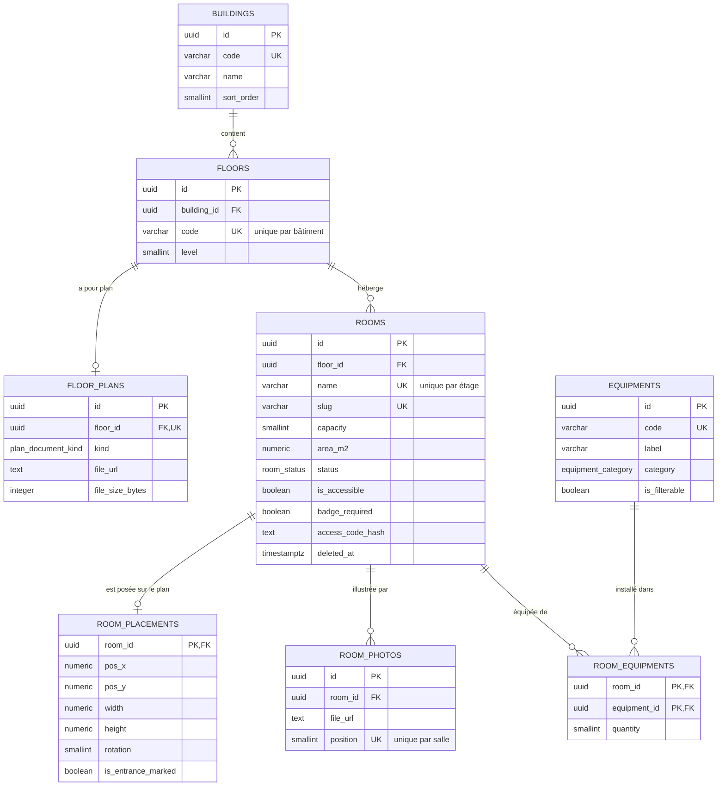
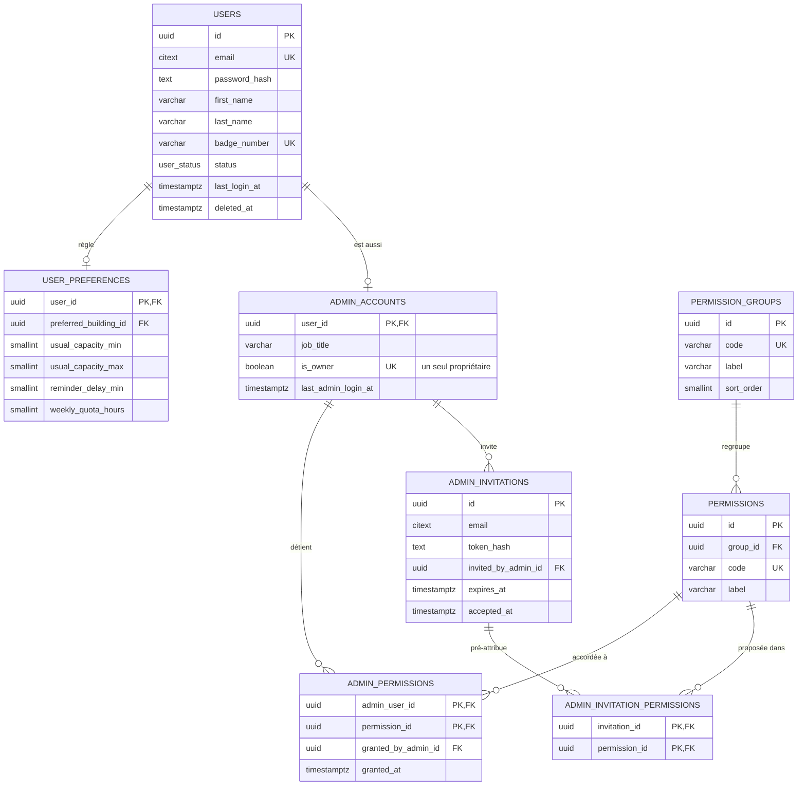
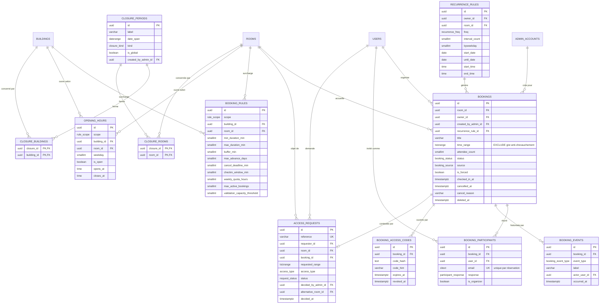
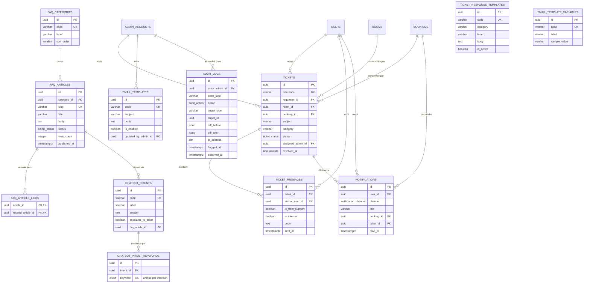

# SmartRoom Manager — Modèle conceptuel et logique

Phase 2 : modélisation des salles, équipements, utilisateurs et créneaux.
Cible : PostgreSQL 16, SQLAlchemy 2.0, FastAPI, Alembic.

Conventions appliquées à **toutes** les tables :

| Élément | Règle |
|---|---|
| Clé primaire | `id UUID` par défaut `gen_random_uuid()` (extension `pgcrypto`) |
| Horodatage | `created_at`, `updated_at` en `TIMESTAMPTZ NOT NULL DEFAULT now()` |
| Suppression logique | `deleted_at TIMESTAMPTZ NULL` sur `rooms`, `users`, `bookings` uniquement |
| Tables | pluriel `snake_case` — Colonnes | `snake_case` — FK suffixées `_id` |
| Contraintes | `pk_`, `fk_`, `uq_`, `ck_`, `ex_` (EXCLUDE) — Index | `idx_` |

38 tables réparties en 4 domaines : **parc** (8), **comptes** (8), **réservation** (10), **support et traçabilité** (12).

---

## 1. Types énumérés

Enums natifs PostgreSQL. Les cinq premiers sont imposés par le cahier, les suivants
évitent des colonnes texte libres sur des ensembles fermés et courts.

| Type | Valeurs |
|---|---|
| `booking_status` | `en_attente`, `confirmee`, `terminee`, `annulee` |
| `room_status` | `disponible`, `maintenance`, `archivee` |
| `ticket_status` | `ouvert`, `en_cours`, `resolu`, `ferme` |
| `access_type` | `hors_jour_ouverture`, `hors_horaire`, `depassement_capacite`, `equipement_indisponible`, `conflit_reservation` |
| `notification_channel` | `email`, `in_app` |
| `booking_source` | `utilisateur`, `admin`, `recurrente`, `blocage` |
| `booking_event_type` | `creation`, `confirmation`, `modification`, `rappel`, `checkin`, `annulation`, `liberation_auto` |
| `participant_response` | `en_attente`, `accepte`, `decline` |
| `user_status` | `actif`, `suspendu` |
| `request_status` | `ouvert`, `accorde`, `refuse`, `reoriente` |
| `rule_scope` | `global`, `batiment`, `salle` |
| `closure_kind` | `fermeture`, `exception` |
| `recurrence_freq` | `hebdomadaire`, `bihebdomadaire`, `mensuelle` |
| `equipment_category` | `audiovisuel`, `mobilier`, `amenagement` |
| `article_status` | `brouillon`, `publie` |
| `audit_action` | `creation`, `modification`, `suppression`, `permission`, `maintenance`, `connexion` |
| `plan_document_kind` | `image`, `pdf` |

---

## 2. Domaine parc

### 2.1 `buildings`

| Colonne | Type | Note |
|---|---|---|
| `id` | UUID PK | |
| `code` | VARCHAR(4) UNIQUE | `A`, `B`, `C` — repris dans le préfixe des codes d'accès |
| `name` | VARCHAR(120) NOT NULL | « Campus Eiffel » |
| `address` | VARCHAR(255) | |
| `sort_order` | SMALLINT NOT NULL DEFAULT 0 | ordre d'affichage des filtres |
| `created_at` / `updated_at` | TIMESTAMPTZ | |

### 2.2 `floors`

| Colonne | Type | Note |
|---|---|---|
| `id` | UUID PK | |
| `building_id` | UUID FK → `buildings` | ON DELETE RESTRICT |
| `code` | VARCHAR(8) NOT NULL | `RDC`, `1er`, `2e`, `3e` |
| `label` | VARCHAR(60) NOT NULL | |
| `level` | SMALLINT NOT NULL | entier signé, `-1` sous-sol — sert au tri, `code` étant du texte |
| `created_at` / `updated_at` | TIMESTAMPTZ | |

`uq_floors_building_code (building_id, code)`.

### 2.3 `floor_plans`

Document de plan déposé par l'administration (écran A-08), un par étage au maximum.

| Colonne | Type | Note |
|---|---|---|
| `id` | UUID PK | |
| `floor_id` | UUID FK → `floors` UNIQUE | relation 1–1 |
| `kind` | `plan_document_kind` NOT NULL | image affichée en fond SVG, PDF affiché en cadre |
| `file_url` | TEXT NOT NULL | |
| `file_name` | VARCHAR(160) NOT NULL | |
| `file_size_bytes` | INTEGER NOT NULL | `CHECK > 0 AND <= 5 Mo` |
| `uploaded_by_admin_id` | UUID FK → `admin_accounts` NULL | ON DELETE SET NULL |
| `uploaded_at` | TIMESTAMPTZ NOT NULL | |
| `created_at` / `updated_at` | TIMESTAMPTZ | |

### 2.4 `rooms`

| Colonne | Type | Note |
|---|---|---|
| `id` | UUID PK | |
| `floor_id` | UUID FK → `floors` | ON DELETE RESTRICT |
| `name` | VARCHAR(120) NOT NULL | |
| `slug` | VARCHAR(140) UNIQUE | identifiant d'URL stable côté front |
| `capacity` | SMALLINT NOT NULL | `CHECK capacity BETWEEN 1 AND 500` |
| `area_m2` | NUMERIC(6,2) NOT NULL | `CHECK area_m2 > 0` |
| `status` | `room_status` NOT NULL DEFAULT `disponible` | |
| `is_accessible` | BOOLEAN NOT NULL DEFAULT false | accessibilité PMR |
| `badge_required` | BOOLEAN NOT NULL DEFAULT true | conditionne l'émission d'un code par réservation |
| `access_code_hash` | TEXT NULL | code permanent du terminal de la salle, jamais en clair |
| `description` | TEXT | |
| `created_at` / `updated_at` / `deleted_at` | TIMESTAMPTZ | |

`uq_rooms_floor_name (floor_id, name)` — un nom de salle est unique par étage, pas globalement.

### 2.5 `room_placements`

Géométrie de la salle sur le plan de son étage. Relation 1–1 optionnelle.

| Colonne | Type | Note |
|---|---|---|
| `room_id` | UUID PK, FK → `rooms` | ON DELETE CASCADE |
| `pos_x` / `pos_y` | NUMERIC(5,2) NOT NULL | pourcentage du viewBox, `CHECK BETWEEN 0 AND 100` |
| `width` / `height` | NUMERIC(5,2) NOT NULL | `CHECK > 0` |
| `rotation` | SMALLINT NOT NULL DEFAULT 0 | `CHECK rotation IN (0, 90, 180, 270)` |
| `is_entrance_marked` | BOOLEAN NOT NULL DEFAULT false | |
| `created_at` / `updated_at` | TIMESTAMPTZ | |

### 2.6 `equipments`

| Colonne | Type | Note |
|---|---|---|
| `id` | UUID PK | |
| `code` | VARCHAR(40) UNIQUE NOT NULL | `visio`, `screen4k` |
| `label` | VARCHAR(80) NOT NULL | |
| `category` | `equipment_category` NOT NULL | |
| `icon` | VARCHAR(40) NOT NULL | clé de la table d'icônes du front |
| `description` | VARCHAR(255) | |
| `is_filterable` | BOOLEAN NOT NULL DEFAULT false | expose l'équipement dans les filtres utilisateur |
| `created_at` / `updated_at` | TIMESTAMPTZ | |

### 2.7 `room_equipments`

| Colonne | Type | Note |
|---|---|---|
| `room_id` | UUID FK → `rooms` | ON DELETE CASCADE |
| `equipment_id` | UUID FK → `equipments` | ON DELETE RESTRICT |
| `quantity` | SMALLINT NOT NULL DEFAULT 1 | `CHECK quantity > 0` |
| `created_at` | TIMESTAMPTZ | |

PK composite `(room_id, equipment_id)`. Suppression physique : table de liaison.

### 2.8 `room_photos`

| Colonne | Type | Note |
|---|---|---|
| `id` | UUID PK | |
| `room_id` | UUID FK → `rooms` | ON DELETE CASCADE |
| `file_url` | TEXT NOT NULL | |
| `alt_text` | VARCHAR(160) | |
| `position` | SMALLINT NOT NULL | `CHECK position BETWEEN 0 AND 5` — six visuels au maximum |
| `created_at` / `updated_at` | TIMESTAMPTZ | |

`uq_room_photos_position (room_id, position)`. La position `0` est le visuel de couverture.

---

## 3. Domaine comptes et permissions

### 3.1 `users`

| Colonne | Type | Note |
|---|---|---|
| `id` | UUID PK | |
| `email` | CITEXT UNIQUE NOT NULL | insensible à la casse sans fonction d'index |
| `password_hash` | TEXT NOT NULL | bcrypt via passlib |
| `first_name` / `last_name` | VARCHAR(80) NOT NULL | |
| `phone` | VARCHAR(20) | |
| `promotion` | VARCHAR(60) | nul pour le personnel |
| `department` | VARCHAR(60) | |
| `badge_number` | VARCHAR(20) UNIQUE | |
| `status` | `user_status` NOT NULL DEFAULT `actif` | la suspension bloque toute nouvelle réservation |
| `last_login_at` | TIMESTAMPTZ | |
| `created_at` / `updated_at` / `deleted_at` | TIMESTAMPTZ | |

### 3.2 `user_preferences`

Relation 1–1 optionnelle : colonnes toutes facultatives, sorties de `users` pour ne pas
alourdir la table lue à chaque requête authentifiée.

| Colonne | Type | Note |
|---|---|---|
| `user_id` | UUID PK, FK → `users` | ON DELETE CASCADE |
| `preferred_building_id` | UUID FK → `buildings` NULL | ON DELETE SET NULL — pondère la recommandation |
| `usual_capacity_min` / `usual_capacity_max` | SMALLINT | `CHECK min <= max` |
| `email_notifications` | BOOLEAN NOT NULL DEFAULT true | |
| `in_app_notifications` | BOOLEAN NOT NULL DEFAULT true | |
| `reminder_delay_min` | SMALLINT NOT NULL DEFAULT 30 | `CHECK BETWEEN 5 AND 1440` |
| `weekly_quota_hours` | SMALLINT NOT NULL DEFAULT 12 | quota individuel, surcharge la règle globale |
| `created_at` / `updated_at` | TIMESTAMPTZ | |

### 3.3 `admin_accounts`

Spécialisation 1–1 de `users` : un administrateur est d'abord une personne.

| Colonne | Type | Note |
|---|---|---|
| `user_id` | UUID PK, FK → `users` | ON DELETE CASCADE |
| `job_title` | VARCHAR(80) NOT NULL | « Directeur IT », affiché en pied de menu |
| `is_owner` | BOOLEAN NOT NULL DEFAULT false | le propriétaire conserve toutes les permissions |
| `last_admin_login_at` | TIMESTAMPTZ | distinct de `users.last_login_at` : deux sessions |
| `created_at` / `updated_at` | TIMESTAMPTZ | |

`uq_admin_accounts_single_owner` : index unique partiel `WHERE is_owner` — un seul propriétaire.

### 3.4 `permission_groups`

| Colonne | Type | Note |
|---|---|---|
| `id` | UUID PK | |
| `code` | VARCHAR(40) UNIQUE NOT NULL | `espaces`, `utilisateurs`, `operations`, `administration` |
| `label` | VARCHAR(80) NOT NULL | |
| `sort_order` | SMALLINT NOT NULL DEFAULT 0 | ordre des sections de la matrice A-12 |

### 3.5 `permissions`

| Colonne | Type | Note |
|---|---|---|
| `id` | UUID PK | |
| `group_id` | UUID FK → `permission_groups` | ON DELETE RESTRICT |
| `code` | VARCHAR(40) UNIQUE NOT NULL | `rooms.manage`, `rules.configure`, `users.manage`, `support.handle`, `conflicts.arbitrate`, `data.export`, `system.configure` |
| `label` | VARCHAR(120) NOT NULL | |
| `sort_order` | SMALLINT NOT NULL DEFAULT 0 | |

### 3.6 `admin_permissions`

| Colonne | Type | Note |
|---|---|---|
| `admin_user_id` | UUID FK → `admin_accounts` | ON DELETE CASCADE |
| `permission_id` | UUID FK → `permissions` | ON DELETE CASCADE |
| `granted_by_admin_id` | UUID FK → `admin_accounts` NULL | ON DELETE SET NULL — traçabilité de l'octroi |
| `granted_at` | TIMESTAMPTZ NOT NULL | |

PK composite `(admin_user_id, permission_id)`. Suppression physique.

### 3.7 `admin_invitations`

| Colonne | Type | Note |
|---|---|---|
| `id` | UUID PK | |
| `email` | CITEXT NOT NULL | `CHECK` sur le motif d'adresse |
| `token_hash` | TEXT NOT NULL | le jeton en clair n'existe que dans l'e-mail |
| `invited_by_admin_id` | UUID FK → `admin_accounts` | ON DELETE RESTRICT |
| `sent_at` | TIMESTAMPTZ NOT NULL | |
| `expires_at` | TIMESTAMPTZ NOT NULL | `CHECK expires_at > sent_at` |
| `accepted_at` | TIMESTAMPTZ NULL | |
| `revoked_at` | TIMESTAMPTZ NULL | |
| `created_at` / `updated_at` | TIMESTAMPTZ | |

`uq_admin_invitations_pending` : index unique partiel sur `email` `WHERE accepted_at IS NULL AND revoked_at IS NULL`.

### 3.8 `admin_invitation_permissions`

PK composite `(invitation_id, permission_id)`, deux FK en `ON DELETE CASCADE`. Le
périmètre est choisi dès l'invitation, le compte arrive avec ses droits.

---

## 4. Domaine réservation et règles

### 4.1 `bookings`

| Colonne | Type | Note |
|---|---|---|
| `id` | UUID PK | |
| `room_id` | UUID FK → `rooms` | ON DELETE RESTRICT — une salle réservée ne disparaît pas |
| `owner_id` | UUID FK → `users` NULL | ON DELETE RESTRICT — NULL pour un blocage administratif |
| `created_by_admin_id` | UUID FK → `admin_accounts` NULL | ON DELETE SET NULL |
| `recurrence_rule_id` | UUID FK → `recurrence_rules` NULL | ON DELETE SET NULL — l'occurrence survit à la série |
| `title` | VARCHAR(160) NOT NULL | |
| `time_range` | TSTZRANGE NOT NULL | borne `[)` — le créneau est **une** donnée, pas deux colonnes |
| `attendee_count` | SMALLINT NOT NULL | `CHECK > 0` — instantané de l'effectif annoncé |
| `status` | `booking_status` NOT NULL DEFAULT `confirmee` | |
| `source` | `booking_source` NOT NULL DEFAULT `utilisateur` | colonne « Source » de l'écran A-03 |
| `is_forced` | BOOLEAN NOT NULL DEFAULT false | créée en ignorant les règles, jamais en ignorant un conflit |
| `checked_in_at` | TIMESTAMPTZ NULL | absence de valeur après la fenêtre = no-show |
| `cancelled_at` | TIMESTAMPTZ NULL | |
| `cancel_reason` | VARCHAR(255) NULL | `CHECK` : obligatoire dès que `status = annulee` |
| `created_at` / `updated_at` / `deleted_at` | TIMESTAMPTZ | |

Contraintes portées par la base :

- `ck_bookings_range_bounds` : `lower(time_range) IS NOT NULL AND upper(time_range) IS NOT NULL AND NOT isempty(time_range)`.
- `ck_bookings_duration` : durée comprise entre 30 minutes et 4 heures.
- `ck_bookings_cancel_reason` : motif renseigné si et seulement si le statut vaut `annulee`.
- **`ex_bookings_no_overlap`** : `EXCLUDE USING gist (room_id WITH =, time_range WITH &&) WHERE (status <> 'annulee' AND deleted_at IS NULL)` — la double réservation est impossible au niveau base, indépendamment du code applicatif. C'est la contrainte centrale du sujet.

### 4.2 `booking_participants`

| Colonne | Type | Note |
|---|---|---|
| `id` | UUID PK | |
| `booking_id` | UUID FK → `bookings` | ON DELETE CASCADE |
| `user_id` | UUID FK → `users` NULL | ON DELETE SET NULL — un invité externe n'a pas de compte |
| `email` | CITEXT NOT NULL | source de vérité de l'invitation |
| `display_name` | VARCHAR(120) NOT NULL | |
| `response` | `participant_response` NOT NULL DEFAULT `en_attente` | |
| `is_organizer` | BOOLEAN NOT NULL DEFAULT false | |
| `responded_at` | TIMESTAMPTZ NULL | |
| `created_at` / `updated_at` | TIMESTAMPTZ | |

`uq_booking_participants_email (booking_id, email)` et index unique partiel « un seul organisateur par réservation ».

### 4.3 `booking_events`

Journal append-only alimentant la frise de l'écran de détail.

| Colonne | Type | Note |
|---|---|---|
| `id` | UUID PK | |
| `booking_id` | UUID FK → `bookings` | ON DELETE CASCADE |
| `event_type` | `booking_event_type` NOT NULL | |
| `label` | VARCHAR(160) NOT NULL | libellé figé au moment du fait |
| `actor_user_id` | UUID FK → `users` NULL | ON DELETE SET NULL |
| `occurred_at` | TIMESTAMPTZ NOT NULL | |
| `created_at` | TIMESTAMPTZ | |

### 4.4 `booking_access_codes`

| Colonne | Type | Note |
|---|---|---|
| `id` | UUID PK | |
| `booking_id` | UUID FK → `bookings` | ON DELETE CASCADE |
| `code_hash` | TEXT NOT NULL | le code en clair ne vit que dans l'e-mail et l'écran |
| `code_hint` | VARCHAR(8) NOT NULL | `A-****`, suffisant pour l'affichage masqué |
| `issued_at` | TIMESTAMPTZ NOT NULL | |
| `expires_at` | TIMESTAMPTZ NOT NULL | `CHECK expires_at > issued_at` |
| `revoked_at` | TIMESTAMPTZ NULL | |
| `created_at` / `updated_at` | TIMESTAMPTZ | |

`uq_booking_access_codes_active` : index unique partiel sur `booking_id` `WHERE revoked_at IS NULL` — un seul code actif par réservation.

### 4.5 `recurrence_rules`

| Colonne | Type | Note |
|---|---|---|
| `id` | UUID PK | |
| `owner_id` | UUID FK → `users` | ON DELETE RESTRICT |
| `room_id` | UUID FK → `rooms` | ON DELETE RESTRICT |
| `freq` | `recurrence_freq` NOT NULL | |
| `interval_count` | SMALLINT NOT NULL DEFAULT 1 | `CHECK BETWEEN 1 AND 12` |
| `byweekday` | SMALLINT[] NOT NULL | `CHECK` : valeurs dans `0..6`, tableau non vide |
| `start_date` | DATE NOT NULL | |
| `until_date` | DATE NOT NULL | `CHECK until_date >= start_date` |
| `start_time` / `end_time` | TIME NOT NULL | `CHECK end_time > start_time` |
| `created_at` / `updated_at` | TIMESTAMPTZ | |

Les occurrences sont matérialisées en lignes de `bookings` : c'est la seule façon de leur
appliquer la contrainte anti-chevauchement.

### 4.6 `booking_rules`

| Colonne | Type | Note |
|---|---|---|
| `id` | UUID PK | |
| `scope` | `rule_scope` NOT NULL | |
| `building_id` | UUID FK → `buildings` NULL | ON DELETE CASCADE |
| `room_id` | UUID FK → `rooms` NULL | ON DELETE CASCADE |
| `min_duration_min` | SMALLINT NOT NULL DEFAULT 30 | `CHECK >= 15` |
| `max_duration_min` | SMALLINT NOT NULL DEFAULT 240 | `CHECK > min_duration_min` |
| `buffer_min` | SMALLINT NOT NULL DEFAULT 15 | battement exigé entre deux réunions |
| `max_advance_days` | SMALLINT NOT NULL DEFAULT 60 | anticipation maximale |
| `cancel_deadline_min` | SMALLINT NOT NULL DEFAULT 60 | délai d'annulation sans pénalité |
| `checkin_window_min` | SMALLINT NOT NULL DEFAULT 10 | `CHECK >= 5` — au-delà, libération automatique |
| `weekly_quota_hours` | SMALLINT NOT NULL DEFAULT 12 | `CHECK weekly_quota_hours * 60 >= max_duration_min` |
| `max_active_bookings` | SMALLINT NOT NULL DEFAULT 10 | quota de réservations actives |
| `validation_capacity_threshold` | SMALLINT NULL | au-delà, une validation administrative est requise |
| `created_at` / `updated_at` | TIMESTAMPTZ | |

`ck_booking_rules_scope_target` : exactement une cible renseignée selon la portée.
Trois index uniques partiels garantissent une seule règle globale, une par bâtiment, une par salle.
Résolution applicative : salle, puis bâtiment, puis global.

### 4.7 `opening_hours`

| Colonne | Type | Note |
|---|---|---|
| `id` | UUID PK | |
| `scope` | `rule_scope` NOT NULL | `global` ou `batiment` ou `salle` |
| `building_id` / `room_id` | UUID FK NULL | ON DELETE CASCADE |
| `weekday` | SMALLINT NOT NULL | `CHECK BETWEEN 0 AND 6`, 0 = dimanche |
| `is_open` | BOOLEAN NOT NULL DEFAULT true | une fermeture reste une ligne, pas une absence de ligne |
| `opens_at` / `closes_at` | TIME NOT NULL | `CHECK closes_at > opens_at` |
| `created_at` / `updated_at` | TIMESTAMPTZ | |

`uq_opening_hours_scope_weekday` : trois index uniques partiels, un par portée.

### 4.8 `closure_periods`

| Colonne | Type | Note |
|---|---|---|
| `id` | UUID PK | |
| `label` | VARCHAR(160) NOT NULL | motif affiché dans l'aperçu annuel |
| `date_span` | DATERANGE NOT NULL | `CHECK NOT isempty(date_span)` |
| `kind` | `closure_kind` NOT NULL | |
| `is_global` | BOOLEAN NOT NULL DEFAULT true | |
| `created_by_admin_id` | UUID FK → `admin_accounts` NULL | ON DELETE SET NULL |
| `created_at` / `updated_at` | TIMESTAMPTZ | |

Index GiST sur `date_span` pour l'aperçu annuel et le moteur de disponibilité.

### 4.9 `closure_buildings` et `closure_rooms`

Deux tables de liaison, PK composites, FK en `ON DELETE CASCADE`. Une fermeture globale
n'a aucune ligne dans ces tables ; deux tables valent mieux qu'une colonne polymorphe non
contraignable par une clé étrangère.

### 4.10 `access_requests`

File unique d'arbitrage de l'écran A-04, quel que soit le motif.

| Colonne | Type | Note |
|---|---|---|
| `id` | UUID PK | |
| `reference` | VARCHAR(16) UNIQUE NOT NULL | `#CONF-8492`, lisible par le support |
| `requester_id` | UUID FK → `users` | ON DELETE RESTRICT |
| `room_id` | UUID FK → `rooms` | ON DELETE RESTRICT |
| `booking_id` | UUID FK → `bookings` NULL | ON DELETE SET NULL — réservation contestée |
| `requested_range` | TSTZRANGE NOT NULL | |
| `access_type` | `access_type` NOT NULL | motif du passage en file |
| `reason` | TEXT | |
| `status` | `request_status` NOT NULL DEFAULT `ouvert` | |
| `decided_by_admin_id` | UUID FK → `admin_accounts` NULL | ON DELETE SET NULL |
| `decision_comment` | TEXT | trace de la décision, reprise au journal d'audit |
| `alternative_room_id` | UUID FK → `rooms` NULL | ON DELETE SET NULL |
| `decided_at` | TIMESTAMPTZ NULL | `CHECK` : renseigné si et seulement si le statut n'est plus `ouvert` |
| `created_at` / `updated_at` | TIMESTAMPTZ | |

### 4.11 Statistiques — `mv_room_occupancy_hourly`

Vue matérialisée agrégeant les réservations non annulées par salle, date et heure :
`room_id`, `building_id`, `occupancy_date`, `hour_of_day`, `booking_count`, `booked_minutes`,
`checked_in_count`. Rafraîchissement `CONCURRENTLY` (index unique requis) par tâche planifiée
horaire ; les tableaux de bord tolèrent une heure de retard, la file d'arbitrage lit les tables.

---

## 5. Domaine support et traçabilité

### 5.1 `tickets`

`id`, `reference` (VARCHAR UNIQUE, `#152`), `requester_id` (FK `users`, RESTRICT),
`room_id` (FK `rooms` NULL, SET NULL), `booking_id` (FK `bookings` NULL, SET NULL),
`subject`, `category` (VARCHAR(40)), `status` (`ticket_status`), `assigned_admin_id`
(FK `admin_accounts` NULL, SET NULL), `first_response_at`, `resolved_at`,
`created_at` / `updated_at`.

### 5.2 `ticket_messages`

`id`, `ticket_id` (FK CASCADE), `author_user_id` (FK `users` NULL, SET NULL),
`is_from_support` BOOLEAN, `is_internal` BOOLEAN — une note interne reste dans le fil mais
n'est jamais envoyée au demandeur —, `body` TEXT, `sent_at`, `created_at`.

### 5.3 `ticket_response_templates`

`id`, `code` UNIQUE, `category`, `label`, `body`, `is_active`, `created_at` / `updated_at`.

### 5.4 `faq_categories`

`id`, `code` UNIQUE, `label`, `icon`, `sort_order`.

### 5.5 `faq_articles`

`id`, `category_id` (FK RESTRICT), `slug` UNIQUE, `title`, `excerpt`, `body`,
`status` (`article_status`), `view_count` INTEGER NOT NULL DEFAULT 0 — compteur dénormalisé,
un COUNT sur les vues serait recalculé à chaque affichage —, `published_at`,
`created_at` / `updated_at`.

### 5.6 `faq_article_links`

Auto-relation M–N des articles liés : `article_id`, `related_article_id`, PK composite,
`CHECK article_id <> related_article_id`, deux FK CASCADE.

### 5.7 `chatbot_intents`

`id`, `code` UNIQUE, `label`, `answer` TEXT, `escalates_to_ticket` BOOLEAN,
`faq_article_id` (FK NULL, SET NULL), `is_active`, `created_at` / `updated_at`.

### 5.8 `chatbot_intent_keywords`

`id`, `intent_id` (FK CASCADE), `keyword` CITEXT, `uq (intent_id, keyword)`.
Table plutôt que tableau : un mot-clé se recherche et s'indexe.

### 5.9 `notifications`

`id`, `user_id` (FK CASCADE), `channel` (`notification_channel`), `title`, `body`,
`booking_id` (FK NULL, SET NULL), `ticket_id` (FK NULL, SET NULL), `read_at`, `sent_at`,
`created_at`. Index partiel sur `(user_id)` `WHERE read_at IS NULL` pour le compteur de la barre.

### 5.10 `email_templates`

`id`, `code` UNIQUE (`tpl-confirmation`), `name`, `trigger_label`, `subject`, `body`,
`is_enabled` BOOLEAN, `updated_by_admin_id` (FK NULL, SET NULL), `created_at` / `updated_at`.

### 5.11 `email_template_variables`

`id`, `code` UNIQUE (`prenom`, `salle`, `code_acces`), `label`, `sample_value`.
Référentiel des variables autorisées : il permet de refuser un modèle citant une variable
inconnue, qui resterait non remplacée à l'envoi.

### 5.12 `audit_logs`

| Colonne | Type | Note |
|---|---|---|
| `id` | UUID PK | |
| `actor_admin_id` | UUID FK → `admin_accounts` NULL | ON DELETE SET NULL — NULL = action système |
| `actor_label` | VARCHAR(120) NOT NULL | nom figé : le journal doit rester lisible après suppression du compte |
| `action` | `audit_action` NOT NULL | |
| `target_type` | VARCHAR(60) NOT NULL | |
| `target_id` | UUID NULL | pas de FK : la cible peut avoir disparu |
| `target_label` | VARCHAR(160) NOT NULL | |
| `diff_before` / `diff_after` | JSONB | états comparés champ par champ |
| `ip_address` | INET | |
| `user_agent` | VARCHAR(255) | |
| `session_id` | VARCHAR(64) | |
| `flagged_at` | TIMESTAMPTZ NULL | un signalement s'ajoute, n'efface rien |
| `flag_reason` | VARCHAR(255) NULL | |
| `occurred_at` | TIMESTAMPTZ NOT NULL | |
| `created_at` | TIMESTAMPTZ | |

Table append-only : aucun `UPDATE` hors signalement, aucun `DELETE`. C'est cette propriété
qui rend l'audit opposable.

---

## 6. Table des relations et cardinalités

| Parent | Enfant | Cardinalité | Clé étrangère | ON DELETE | Justification |
|---|---|---|---|---|---|
| `buildings` | `floors` | 1–N | `floors.building_id` | RESTRICT | un bâtiment avec étages ne se supprime pas par accident |
| `floors` | `rooms` | 1–N | `rooms.floor_id` | RESTRICT | idem, la salle est archivée et non supprimée |
| `floors` | `floor_plans` | 1–1 | `floor_plans.floor_id` UNIQUE | CASCADE | le plan n'a pas de sens sans son étage |
| `rooms` | `room_placements` | 1–1 | `room_placements.room_id` | CASCADE | géométrie purement dépendante |
| `rooms` | `room_photos` | 1–N | `room_photos.room_id` | CASCADE | visuels sans existence propre |
| `rooms` | `room_equipments` | 1–N | `room_equipments.room_id` | CASCADE | liaison |
| `equipments` | `room_equipments` | 1–N | `room_equipments.equipment_id` | RESTRICT | un équipement encore posé ne se supprime pas |
| `users` | `user_preferences` | 1–1 | `user_preferences.user_id` | CASCADE | extension du compte |
| `users` | `admin_accounts` | 1–1 (0..1) | `admin_accounts.user_id` | CASCADE | spécialisation |
| `buildings` | `user_preferences` | 1–N | `user_preferences.preferred_building_id` | SET NULL | préférence, pas dépendance |
| `permission_groups` | `permissions` | 1–N | `permissions.group_id` | RESTRICT | référentiel figé |
| `admin_accounts` | `admin_permissions` | 1–N | `admin_permissions.admin_user_id` | CASCADE | droits attachés au compte |
| `permissions` | `admin_permissions` | 1–N | `admin_permissions.permission_id` | CASCADE | liaison |
| `admin_accounts` | `admin_invitations` | 1–N | `admin_invitations.invited_by_admin_id` | RESTRICT | trace de l'invitant |
| `admin_invitations` | `admin_invitation_permissions` | 1–N | `invitation_id` | CASCADE | liaison |
| `rooms` | `bookings` | 1–N | `bookings.room_id` | RESTRICT | une salle réservée ne disparaît pas |
| `users` | `bookings` | 1–N (0..1 côté FK) | `bookings.owner_id` | RESTRICT | un blocage administratif n'a pas de propriétaire |
| `admin_accounts` | `bookings` | 1–N | `bookings.created_by_admin_id` | SET NULL | l'historique survit au départ de l'admin |
| `recurrence_rules` | `bookings` | 1–N | `bookings.recurrence_rule_id` | SET NULL | l'occurrence survit à la suppression de la série |
| `bookings` | `booking_participants` | 1–N | `booking_id` | CASCADE | participants liés au créneau |
| `users` | `booking_participants` | 1–N | `user_id` | SET NULL | un invité peut être externe |
| `bookings` | `booking_events` | 1–N | `booking_id` | CASCADE | frise liée |
| `bookings` | `booking_access_codes` | 1–N (1 actif) | `booking_id` | CASCADE | code sans objet hors réservation |
| `buildings` / `rooms` | `booking_rules` | 0..1 chacun | `building_id`, `room_id` | CASCADE | surcharge supprimée avec sa cible |
| `buildings` / `rooms` | `opening_hours` | 1–N | `building_id`, `room_id` | CASCADE | idem |
| `closure_periods` | `closure_buildings` / `closure_rooms` | 1–N | `closure_id` | CASCADE | portée liée |
| `users` | `access_requests` | 1–N | `requester_id` | RESTRICT | demande conservée |
| `rooms` | `access_requests` | 1–N | `room_id`, `alternative_room_id` | RESTRICT / SET NULL | la salle proposée peut être archivée ensuite |
| `users` | `tickets` | 1–N | `requester_id` | RESTRICT | historique support |
| `tickets` | `ticket_messages` | 1–N | `ticket_id` | CASCADE | fil lié |
| `faq_categories` | `faq_articles` | 1–N | `category_id` | RESTRICT | catégorie non vidable par erreur |
| `faq_articles` | `faq_article_links` | M–N | `article_id`, `related_article_id` | CASCADE | auto-relation |
| `chatbot_intents` | `chatbot_intent_keywords` | 1–N | `intent_id` | CASCADE | mots-clés liés |
| `chatbot_intents` | `faq_articles` | N–1 | `faq_article_id` | SET NULL | l'intention survit à l'article |
| `users` | `notifications` | 1–N | `user_id` | CASCADE | notifications personnelles |
| `admin_accounts` | `audit_logs` | 1–N | `actor_admin_id` | SET NULL | le journal survit au compte, `actor_label` prend le relais |

---

## 7. Diagrammes entité-association

Quatre diagrammes par domaine plutôt qu'un seul : à 38 entités, un diagramme unique
n'est plus lisible, et les domaines ne se croisent qu'en quelques points explicités au 7.5.

### 7.1 Domaine parc

### 7.2 Domaine comptes et permissions

### 7.3 Domaine réservation et règles

### 7.4 Domaine support et traçabilité

### 7.5 Points de jonction entre domaines

| Depuis | Vers | Lien |
|---|---|---|
| Comptes | Parc | `user_preferences.preferred_building_id` |
| Comptes | Parc | `floor_plans.uploaded_by_admin_id` |
| Réservation | Parc | `bookings.room_id`, `booking_rules.room_id`, `opening_hours.room_id`, `closure_rooms.room_id` |
| Réservation | Comptes | `bookings.owner_id`, `bookings.created_by_admin_id`, `access_requests.decided_by_admin_id` |
| Support | Réservation | `tickets.booking_id`, `notifications.booking_id` |
| Support | Comptes | `tickets.requester_id`, `audit_logs.actor_admin_id` |

---

## 8. Décisions de modélisation

**Structure et identité**

1. **UUID v4 générés par la base** plutôt que des entiers séquentiels : les identifiants circulent dans les URL du front et ne doivent pas révéler le volume de données ni permettre l'énumération.
2. **`slug` sur `rooms` et `faq_articles`** en plus de l'UUID : le front expose des URL lisibles, un UUID en barre d'adresse n'est ni mémorisable ni partageable.
3. **Suppression logique restreinte à `rooms`, `users` et `bookings`** : seules ces trois entités sont référencées par des données historiques qu'un `DELETE` rendrait incohérentes ; ailleurs la suppression physique évite d'avoir à filtrer `deleted_at` dans chaque requête.
4. **Tables de liaison en suppression physique et PK composite** : une association n'a pas d'existence propre, lui donner un UUID et un `deleted_at` serait de la surface inutile.

**Créneaux et anti-chevauchement**

5. **`TSTZRANGE` plutôt que `starts_at` / `ends_at`** : le créneau est une donnée unique, les opérateurs `&&`, `@>` et `-` s'appliquent directement, et l'index GiST rend la recherche de disponibilité indexable — ce que deux colonnes séparées ne permettent pas.
6. **`EXCLUDE USING gist` sur `(room_id, time_range)`** : la double réservation devient impossible au niveau base, même en cas de requêtes concurrentes ou de bug applicatif. C'est la garantie que le sujet demande, et aucune vérification en Python ne l'apporte sous concurrence.
7. **Prédicat `WHERE status <> 'annulee' AND deleted_at IS NULL` sur la contrainte** : un créneau annulé redevient immédiatement réservable sans supprimer la ligne, qui reste nécessaire aux statistiques de no-show.
8. **Bornes `[)` sur les intervalles** : deux réunions dont l'une finit quand l'autre commence ne se chevauchent pas ; le battement obligatoire est vérifié séparément, il relève de la règle métier et non de la géométrie du créneau.
9. **Le battement entre réunions n'est pas dans la contrainte EXCLUDE** : il est paramétrable par salle et par bâtiment, alors qu'une contrainte de table est figée ; il est appliqué par le moteur de disponibilité de la phase 3 sur la base de `booking_rules.buffer_min`.
10. **Occurrences récurrentes matérialisées en lignes de `bookings`** : c'est la seule façon de les soumettre à la contrainte anti-chevauchement ; une règle stockée sans occurrences repousserait la détection de conflits dans le code applicatif.

**Comptes et permissions**

11. **`admin_accounts` en spécialisation 1–1 de `users`** plutôt qu'en table de comptes indépendante : un administrateur est une personne de l'annuaire, et l'unicité de l'adresse e-mail reste garantie par une seule table.
12. **Deux rôles applicatifs, aucune colonne `role`** : la qualité d'administrateur est l'existence d'une ligne dans `admin_accounts`, ce qui interdit l'état incohérent « rôle admin sans permissions ».
13. **Permissions en M–N plutôt qu'en sous-rôles** : la maquette A-12 est une matrice permissions × administrateurs, et des rôles nommés obligeraient à créer un rôle par combinaison réellement utilisée.
14. **`is_owner` avec index unique partiel** : un seul propriétaire, et ses permissions ne sont pas révocables — se les retirer fermerait la configuration du système pour tout le monde.
15. **`user_preferences` en table 1–1 séparée** : toutes ses colonnes sont facultatives et ne sont lues que par deux écrans, alors que `users` est chargée à chaque requête authentifiée.

**Règles, horaires et fermetures**

16. **`booking_rules` avec portée hiérarchique `global` < `batiment` < `salle`** : une seule table et trois index uniques partiels, plutôt que trois tables quasi identiques ; la résolution applicative prend la règle la plus spécifique.
17. **Une fermeture hebdomadaire est une ligne `is_open = false`, pas une ligne absente** : l'absence de ligne signifierait « non configuré », état différent de « fermé » et impossible à distinguer autrement.
18. **`closure_periods` en `DATERANGE` avec deux tables de liaison** plutôt qu'une colonne `scope_ids` en tableau : une clé étrangère ne peut pas contraindre les éléments d'un tableau, et la portée doit rester vérifiée par la base.
19. **File d'arbitrage unifiée dans `access_requests`** avec un `access_type` couvrant conflit, dépassement de capacité et accès hors horaires : ces quatre motifs partagent le même cycle de vie et le même écran, quatre tables imposeraient quatre requêtes pour afficher une file unique.

**Codes d'accès et sécurité**

20. **Deux niveaux de code d'accès** : `rooms.access_code_hash` pour le terminal permanent de la salle, `booking_access_codes` pour le code temporaire d'une réservation — ils n'ont ni la même durée de vie ni le même porteur.
21. **Codes et mots de passe stockés hachés, jamais en clair**, avec un `code_hint` de quatre caractères suffisant à l'affichage masqué `A-****` de l'écran de confirmation.
22. **Index unique partiel `WHERE revoked_at IS NULL`** : un seul code actif par réservation, tout en conservant les codes révoqués pour l'audit.

**Traçabilité**

23. **`audit_logs` append-only avec `actor_label` et `target_label` figés** : le journal doit rester lisible après la suppression d'un compte ou d'une salle, ce qu'une simple jointure ne garantirait plus.
24. **`audit_logs.target_id` sans clé étrangère** : la cible est polymorphe et peut avoir disparu ; une FK empêcherait précisément de journaliser une suppression.
25. **`diff_before` / `diff_after` en JSONB** : le format du diff dépend de l'entité modifiée, une table de colonnes modifiées serait plus lourde sans être plus requêtable pour cet usage.
26. **`booking_events` séparée de `audit_logs`** : la frise d'une réservation est visible par son propriétaire, le journal d'audit ne l'est que par l'administration — deux publics, deux tables.

**Dénormalisations assumées**

27. **`bookings.attendee_count`** : instantané de l'effectif annoncé, distinct du nombre de participants réellement invités — c'est lui qui a été confronté à la capacité au moment de la réservation.
28. **`faq_articles.view_count`** : compteur incrémenté, un `COUNT` sur une table de vues serait recalculé à chaque affichage du centre d'aide pour une information purement indicative.
29. **`floors.level` en plus de `floors.code`** : `code` est du texte affiché (`RDC`, `2e`), `level` est l'entier qui permet le tri — les dériver l'un de l'autre en SQL serait fragile.

**Statistiques**

30. **Vue matérialisée `mv_room_occupancy_hourly` plutôt qu'une agrégation à la volée** : les tableaux de bord croisent salle, bâtiment, jour et heure sur six semaines ; l'agrégat est rafraîchi `CONCURRENTLY` toutes les heures, latence acceptable pour un indicateur, alors que la file d'arbitrage et le moteur de disponibilité lisent toujours les tables.
