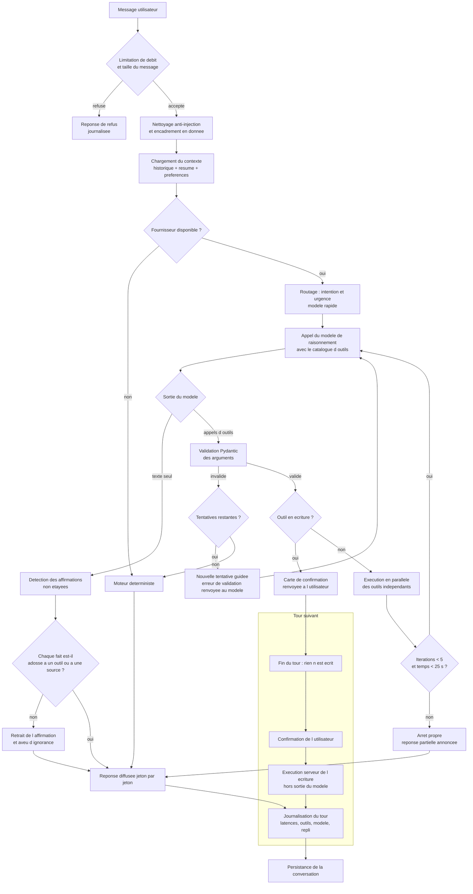

# Assistant conversationnel — architecture (Lot 0)

Document d'architecture. Aucun code : il fixe les décisions que les lots 1 à 6
se contenteront d'exécuter.

---

## 1. Matériel constaté et modèles retenus

Relevé sur la machine de développement, le 28/08/2026 :

| Ressource | Valeur mesurée |
| --- | --- |
| GPU | NVIDIA RTX 5060 Laptop, **8 151 Mio de VRAM** (204 Mio occupés au repos) |
| CPU | Intel i7-13700HX — 16 cœurs, 24 fils |
| RAM | 23,7 Gio au total, **4,6 Gio libres** avec Docker, PostgreSQL, Vite et un navigateur ouverts |
| Ollama | 0.32.14 |

La VRAM est la contrainte qui décide de tout. Un modèle qui n'y tient pas
entièrement voit ses couches restantes exécutées par le processeur, et le
premier jeton passe alors de quelques centaines de millisecondes à plusieurs
secondes. `qwen2.5:14b` pèse 9,0 Gio : il ne tient pas. C'est la seule raison
pour laquelle il est écarté, et elle n'a rien à voir avec sa qualité.

| Rôle | Modèle | Empreinte | Pourquoi celui-là |
| --- | --- | --- | --- |
| Raisonnement, appel d'outils | `qwen2.5:7b` | ~4,7 Gio | Tient entièrement en VRAM à côté du modèle rapide. Gabarit d'appel d'outils natif dans Ollama — pas de protocole JSON maison à réinventer, donc pas de couche supplémentaire susceptible de mal analyser une sortie. |
| Routage, reformulation, résumé | `qwen2.5:3b` | ~1,9 Gio | Même famille, donc même gabarit et même tokeniseur : un seul jeu de conventions à tenir. Assez pour classer une intention et condenser des tours anciens. |
| Vecteurs | `nomic-embed-text` | 274 Mio, **768 dimensions** | Déjà installé, spécialisé, et sa taille le rend gratuit à garder chargé. Fixe la dimension de la colonne `vector(768)`. |

À tirer avant le lot 1 :

```bash
ollama pull qwen2.5:7b
```

Les deux modèles de génération pèsent ensemble ~6,6 Gio : ils cohabitent en
VRAM, ce qui évite un déchargement/rechargement entre le routage et la
réponse — l'aller-retour coûte plusieurs secondes et se voit à l'écran.

`llava` et `llama3.2-vision` restent installés mais ne sont pas utilisés :
aucun parcours de l'assistant ne traite d'image.

---

## 2. Trois étages de fourniture, et un seul contrat

La démonstration se fera **en ligne, sur un hébergement gratuit, testée par
les enseignants via un lien**. Or aucun hébergeur gratuit ne fait tourner un
modèle de 7 milliards de paramètres : pas de GPU, et de l'ordre de 512 Mio à
1 Gio de mémoire. Ollama ne sera donc pas là où la démonstration aura lieu.

C'est une contrainte d'architecture, pas un détail d'exploitation. L'interface
`LLMProvider` existe précisément pour qu'elle ne contamine pas le reste du
code.

| Étage | Fournisseur | Quand | Ce qui fonctionne |
| --- | --- | --- | --- |
| **A — local** | Ollama, `qwen2.5:7b` + `qwen2.5:3b` + `nomic-embed-text` | Poste de développement, soutenance sur machine | Tout : langage naturel, appel d'outils enchaînés, RAG vectoriel, streaming |
| **B — distant** | Un fournisseur compatible OpenAI, choisi par variable d'environnement | Démonstration en ligne, si une clé est fournie | Tout, sous réserve d'anonymisation (§ 9) |
| **C — déterministe** | Moteur d'intentions lexical, aucun modèle | Toujours armé : A et B absents, trop lents, ou sortie inexploitable | Les parcours principaux, sans compréhension libre du langage |

L'étage C **n'est pas une roue de secours théorique** : c'est le mode par
défaut si rien n'est configuré, et le seul mode garanti disponible le jour de
la démonstration en ligne. Il est développé au lot 4 avec le même sérieux que
le reste, et testé au lot 6 comme un chemin nominal.

Le RAG suit la même dégradation : sans modèle de vecteurs joignable, la
recherche hybride retombe sur la seule recherche plein texte française de
PostgreSQL, qui ne demande aucun modèle. Les réponses restent citées et
sourcées ; seul le rappel sémantique baisse.

---

## 3. La boucle d'agent



Deux points de ce schéma portent l'essentiel de la valeur :

- **`M → Y`** : un outil d'écriture ne s'exécute jamais dans le tour où le
  modèle le propose. Le tour se termine sur une carte de confirmation. C'est
  l'utilisateur, au tour suivant, qui déclenche l'écriture — et c'est le
  serveur qui l'exécute, à partir du brouillon qu'il a lui-même conservé, sans
  jamais relire la sortie du modèle.
- **`I → J → R`** : une sortie malformée n'est jamais « rattrapée » par une
  interprétation approximative. Deux tentatives guidées, puis bascule sur le
  déterministe.

---

## 4. Budget de contexte

`qwen2.5:7b` accepte 32 768 jetons. Le budget est plafonné bien en deçà : la
latence croît avec le contexte, et un contexte long ne rend pas les réponses
meilleures, seulement plus lentes.

| Poste | Budget | Note |
| --- | --- | --- |
| Prompt système | **1 376 jetons mesurés** | Fixe, versionné, jamais modifiable par la conversation. Estimation initiale : 900 — corrigée après mesure `tiktoken` du fichier livré |
| Catalogue d'outils | ~1 400 jetons | 13 schémas ; le catalogue est **réduit par le routage** — seuls les outils du domaine détecté sont exposés, ce qui ramène souvent le poste à ~600 |
| Fragments RAG | 1 200 jetons max | 4 fragments de 300 jetons, encadrés comme données |
| Résumé des tours anciens | 400 jetons max | Produit par le modèle rapide |
| Historique récent | 2 500 jetons | Tours entiers, les plus récents d'abord |
| Résultats d'outils du tour | 2 000 jetons | Tronqués par outil, jamais silencieusement |
| Réponse | 800 jetons | `num_predict` |
| **Total visé** | **≤ 9 200 jetons** | Marge volontaire sous les 32 768. Mesuré sur un cas réel — 12 tours d'historique, 1 extrait, résumé actif : **2 204 jetons** |

Stratégie de troncature, dans cet ordre :

1. Les tours sont conservés **entiers** ou retirés entiers. Couper un tour en
   deux laisse une question sans sa réponse, et le modèle répond alors à côté.
2. Au-delà de **8 tours** ou de 2 500 jetons d'historique, les plus anciens
   partent au résumé : `qwen2.5:3b` produit un paragraphe de 400 jetons
   maximum, réécrit à chaque dépassement, jamais empilé.
3. Les résultats d'outils des tours précédents sont remplacés par une ligne :
   nom de l'outil, nombre de résultats, horodatage. Les données brutes ne
   survivent pas au tour qui les a demandées — elles seraient périmées, et une
   donnée périmée présentée comme fraîche est pire qu'absente.
4. Le comptage se fait avec `tiktoken` (encodage `cl100k_base`). Ce n'est pas
   le tokeniseur de Qwen : il surestime de 5 à 10 % sur du français, ce qui
   va dans le bon sens — le budget réel est un peu plus large que le budget
   calculé.

---

## 5. Seuils

Tous administrables depuis A-13 (§ lot 5), versionnés, rechargés à chaud.

| Seuil | Valeur | Ce qu'il protège |
| --- | --- | --- |
| `AGENT_MAX_ITERATIONS` | 5 | Boucle d'outils. Au-delà, arrêt propre et réponse partielle annoncée comme telle |
| `AGENT_MAX_TOOLS_PAR_TOUR` | 8 | Un modèle qui s'emballe ne doit pas inonder la base de requêtes |
| `AGENT_BUDGET_TOUR_MS` | 25 000 | Temps total d'un tour, arrêt inclus |
| `LLM_TIMEOUT_PREMIER_JETON_MS` | **6 000** | Au-delà, bascule déterministe. Valeur initiale 2 500, relevée après mesure : avec le prompt réel et le catalogue d'outils, le premier appel demande 3 455 ms et chaque première question partait au repli |
| `LLM_TIMEOUT_TOTAL_MS` | 20 000 | Génération complète |
| `LLM_TENTATIVES_VALIDATION` | 2 | Nouvelles tentatives guidées après argument invalide |
| `RAG_TOP_K` | 4 | Fragments injectés |
| `RAG_SEUIL_SIMILARITE` | 0,32 | En deçà, le fragment n'est pas cité : un article hors sujet cité fait plus de dégâts qu'une absence de source |
| `RAG_POIDS_FUSION` | 60 | Constante `k` de la fusion de rangs réciproques |
| `CHAT_DEBIT_MESSAGES` | 20 / minute / utilisateur | Limitation de débit |
| `CHAT_TAILLE_MESSAGE` | 2 000 caractères | Un message plus long est un collage, pas une question |
| `CHAT_RETENTION_JOURS` | 90 | Purge des conversations |
| `CONFIRMATION_TTL_S` | 900 | Durée de vie d'un brouillon d'écriture en attente de confirmation |

---

## 6. Politique de repli

**Déclencheurs.** La bascule est automatique et se produit sur l'un de ces
faits, jamais sur une appréciation :

1. Le fournisseur ne répond pas au test de vie au démarrage du tour.
2. Le premier jeton dépasse `LLM_TIMEOUT_PREMIER_JETON_MS`.
3. La génération dépasse `LLM_TIMEOUT_TOTAL_MS`.
4. Deux tentatives de validation d'arguments ont échoué.
5. Le modèle rend une sortie inexploitable : ni texte, ni appel d'outil
   analysable.
6. Le budget du tour est épuisé alors qu'aucune réponse n'a commencé.

**Comportement.** Le moteur déterministe reprend le message d'origine et le
traite par la table `chatbot_intents` déjà en base : normalisation sans
accents, appariement approximatif par `rapidfuzz` sur les mots-clés, seuil de
confiance à 72. Au-dessus, il rend la réponse de l'intention et peut appeler
**les outils en lecture seule** avec des paramètres extraits par expressions
régulières (une capacité, une date, un nom de salle). En dessous, il propose
les trois parcours principaux et l'ouverture d'un ticket.

Le déterministe n'écrit jamais, sauf `creer_ticket`, et seulement après la même
carte de confirmation que l'agent.

**Ce que l'utilisateur voit.** Rien qui ressemble à une panne. La réponse
arrive, en mode dégradé, sans jargon technique. Une mention discrète
« réponse simplifiée » figure dans la charge utile de l'événement — l'écran
U-23 en fait ce qu'il veut. Mentir sur le mode serait pire : un utilisateur
qui croit parler au modèle et reçoit une réponse rigide conclut que le modèle
est mauvais.

**Ce qui est journalisé.** `fallback=true`, le déclencheur exact parmi les six,
la latence atteinte, et l'intention retenue. Le tableau de bord A-13 en fait
un taux : c'est l'indicateur qui dit si la démonstration tiendra.

---

## 7. Budget de latence, par étape

Cible : **premier jeton sous 800 ms** en étage A. Ce budget est une intention
mesurable, pas une promesse : le lot 1 livre la mesure réelle par étape, et le
lot 6 la vérifie.

| Étape | Budget visé | Mesuré (lot 1) |
| --- | --- | --- |
| Limitation de débit, nettoyage | < 5 ms | à mesurer au lot 5 |
| Chargement du contexte (SQL) | < 40 ms | à mesurer au lot 5 |
| Construction du contexte (comptage, troncature, encadrement) | < 30 ms | **< 10 ms** sur 12 tours |
| Vectorisation d'une question (`nomic-embed-text`, 2 textes) | < 250 ms | **191 ms** |
| Premier jeton, modèle chaud (`qwen2.5:3b`) | < 300 ms | **882 ms** |
| Premier jeton, modèle chaud (`qwen2.5:7b`) | < 450 ms | **789 ms** au mieux, 1 138 ms au premier appel du processus |
| Appel d'outil complet (`qwen2.5:7b`, un outil exposé) | < 1 s | **1 506 ms** |
| Préchauffage de `qwen2.5:7b` au démarrage | — | **6 273 ms** |
| Premier jeton, prompt réel + 13 outils (3 439 jetons d'invite) | — | **3 455 ms**, puis **1 524 ms** (invite mise en cache) |
| Premier jeton, catalogue réduit à un domaine (2 903 jetons) | — | **1 700 ms**, puis **835 ms** |
| Recherche hybride sur la base de connaissances | < 250 ms | **155–190 ms**, **7–22 ms** en cache |
| Tour complet par le moteur déterministe | — | **9–630 ms** |

Le routage vaut ce qu'il coûte : réduire le catalogue de treize outils à ceux
d'un domaine retire 536 jetons d'invite et **près de 700 ms** au premier jeton.
| **Cumul avant premier jeton** | **< 800 ms** | **non atteint sur cette machine** |
| Premier appel après démarrage d'Ollama, modèle froid | — | **79 000 ms** — d'où le préchauffage |

**Ce que la mesure a appris, et qui change le code.** Ollama déclare un
`load_duration` de 700 à 750 ms **à chaque requête**, alors même que `/api/ps`
donne le modèle résident et à 100 % sur le GPU. Ce coût fixe suffit à lui seul
à dépasser la cible des 800 ms, avant même la génération. La cible reste écrite
telle quelle — elle vient de l'énoncé — mais elle n'est pas tenue sur ce
matériel, et le rapport doit le dire.

Le premier appel après le démarrage d'Ollama a pris **79 secondes** pour un
modèle de 1,9 Gio, en-têtes HTTP retenus pendant toute la durée. Sans
préchauffage au démarrage de l'application, chaque première question d'une
session partirait donc au repli déterministe et le modèle ne servirait jamais.
`ClientOllama.prechauffer()` existe pour cela, et le lot 5 l'appellera en tâche
de fond au démarrage.

Deux leviers tiennent ces chiffres : `keep_alive` à 30 minutes pour éviter le
rechargement des poids, et la parallélisation des outils indépendants
(§ lot 4). Un cache mémoire des vecteurs de requête et des recherches RAG
fréquentes retire la latence d'embedding sur les questions répétées.

---

## 8. Ce que fait le modèle, ce que fait le code

Cette section est destinée au rapport et à la soutenance. Elle sera reprise
telle quelle dans la documentation du projet.

**Le modèle fait trois choses, et seulement trois :**

1. Il comprend une question posée en langage libre.
2. Il choisit quel outil appeler, et avec quels arguments.
3. Il rédige la réponse à partir de ce que les outils ont rendu.

**Tout le reste est du code déterministe :**

- La disponibilité d'une salle est calculée par `app/domain/availability`, la
  même fonction qu'utilise le calendrier.
- Un conflit est détecté par la contrainte `EXCLUDE USING gist` de PostgreSQL,
  pas par un raisonnement.
- Le score de recommandation vient de `app/domain/recommendation`.
- Les règles de réservation sont appliquées par `app/domain/rules`.
- Les permissions sont vérifiées par le même `Principal` que les routes REST.
- L'identité de l'utilisateur est injectée par le serveur, jamais par le
  modèle.
- Toute écriture est exécutée par le service métier, à partir d'un brouillon
  validé, après confirmation humaine.

Autrement dit : **le modèle ne sait rien du parc et ne décide rien**. Il
traduit une intention en appel de fonction et une réponse de fonction en
phrase. Le mérite technique du projet est dans cette séparation et dans les
garde-fous qui la tiennent — pas dans la taille du modèle.

---

## 9. Sécurité

- **Cloisonnement.** `ToolContext` porte le `Principal` issu du JWT. Aucun
  outil n'accepte d'identifiant d'utilisateur en argument : le schéma exposé
  au modèle n'en contient pas. Un utilisateur qui écrit « montre les
  réservations de Marie » obtient les siennes, ou un refus — jamais celles de
  Marie.
- **Injections.** Le message et les fragments RAG sont encadrés par des
  délimiteurs et annoncés au modèle comme des **données à lire**, jamais comme
  des instructions. Le prompt système est monté côté serveur et n'est jamais
  concaténé à du contenu utilisateur. Un filtre lexical signale les tournures
  d'écrasement de consigne connues ; il journalise et n'échoue pas seul — c'est
  la structure du prompt qui protège, le filtre n'est qu'un capteur.
- **Codes d'accès.** Le code en clair n'existe qu'à l'instant de la création :
  la base n'en garde qu'une empreinte et un indice masqué (`A-****`). L'outil
  `obtenir_code_acces` rend donc l'indice et la fenêtre de validité, et dirige
  vers l'écran de la réservation. Il ne peut pas faire mieux, et prétendre le
  contraire serait un mensonge de conception.
- **Journalisation.** Ni jeton, ni code d'accès, ni mot de passe. Le message
  utilisateur est conservé pour le tableau de bord ; sa rétention est de 90
  jours.
- **Fournisseur distant.** S'il est activé, aucune donnée personnelle ne part
  sans anonymisation préalable : noms et adresses e-mail remplacés par des
  jetons stables le temps de la conversation (`PERSONNE_1`, `SALLE_3`),
  restitués à l'affichage. La table de correspondance ne quitte pas le
  serveur. Ce chemin est désactivé par défaut.

---

## 10. Limites connues, à documenter dans le rapport

- **Hallucinations résiduelles.** La détection des affirmations non étayées
  couvre les faits chiffrés et les noms d'entités ; une formulation vague reste
  possible. Le garde-fou réduit le risque, il ne l'annule pas.
- **Latence dépendante du matériel.** Mesures du lot 1 sur la machine de
  développement : 882 ms de premier jeton avec `qwen2.5:3b` chaud, dont 700 ms
  de `load_duration` déclaré par Ollama à chaque requête ; 79 secondes au tout
  premier appel après démarrage. La cible de 800 ms n'est pas tenue ici.
- **Charge.** Une seule inférence à la fois sur ce matériel. Deux utilisateurs
  simultanés doublent l'attente du second. La limitation de débit et le repli
  déterministe absorbent ce cas ; une vraie mise en production demanderait une
  file d'attente et plusieurs instances.
- **Qualité du français.** `qwen2.5:7b` est correct en français mais moins
  assuré qu'en anglais. Le prompt système impose le français et un ton bref.
- **Démonstration en ligne.** Sans GPU chez l'hébergeur, l'étage A est
  indisponible ; c'est l'étage B ou C qui répondra. À décider avant le lot 5.

---

## 11. Arborescence livrée

```
app/ai/
  providers/     interface LLMProvider, client Ollama, client distant, provider simulé
  agent/         boucle, budget de contexte, streaming, orchestration des outils
  tools/         un fichier par outil : schéma + exécution
  rag/           découpage, vecteurs, indexation, recherche hybride
  guardrails/    validation, anti-injection, détection du non-étayé, repli
  prompts/       prompts système versionnés
app/services/chat_service.py
app/api/v1/chat.py
```
